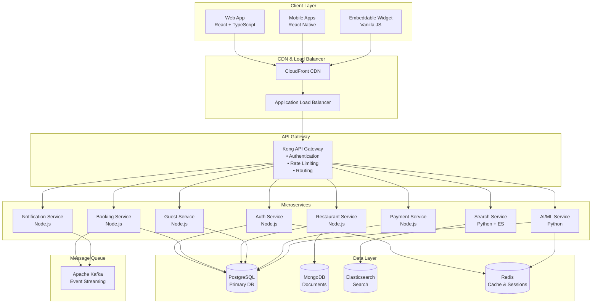
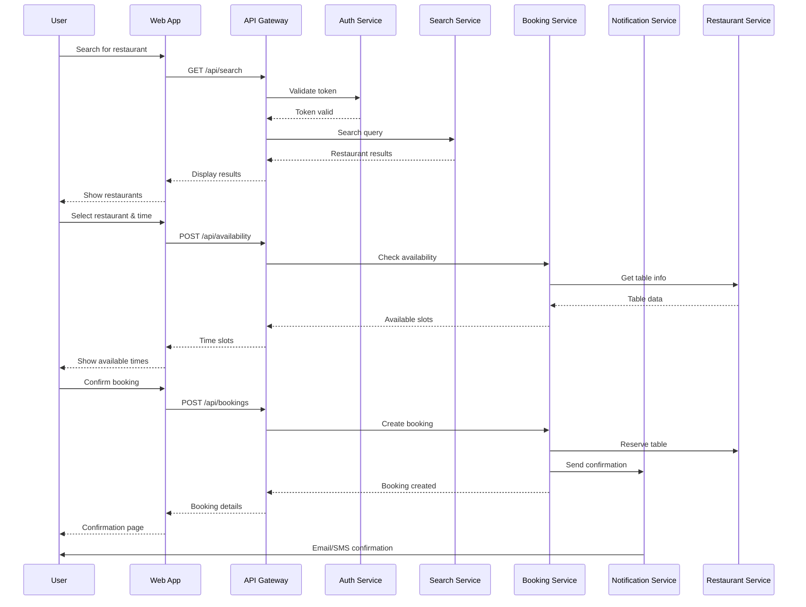
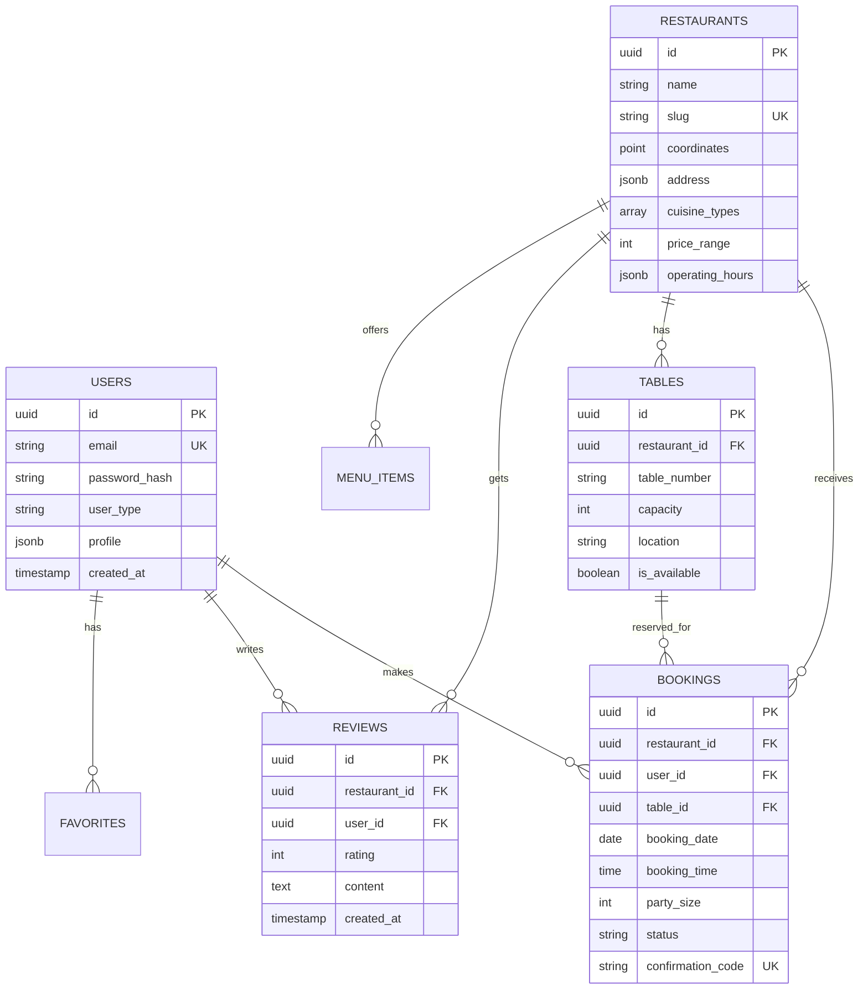
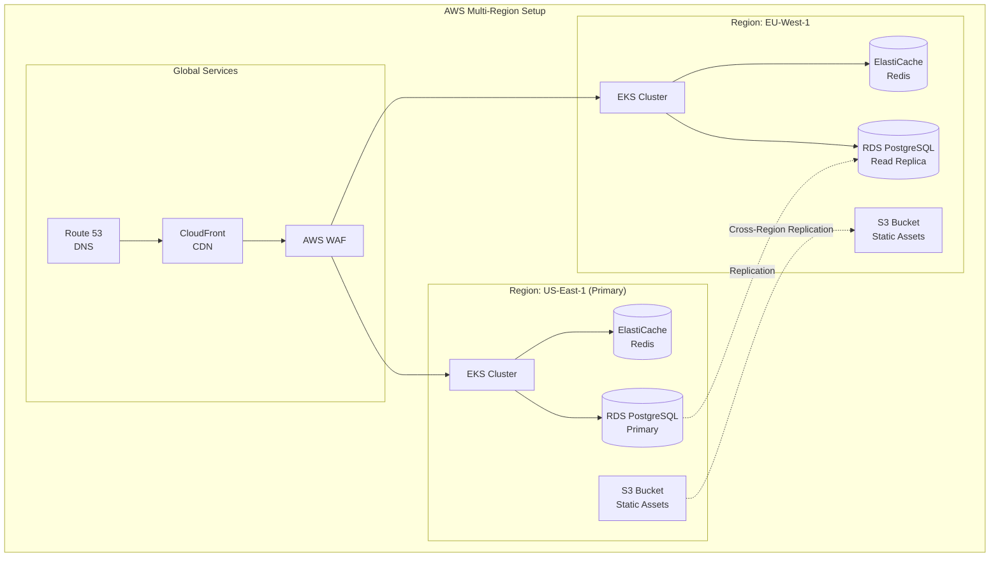
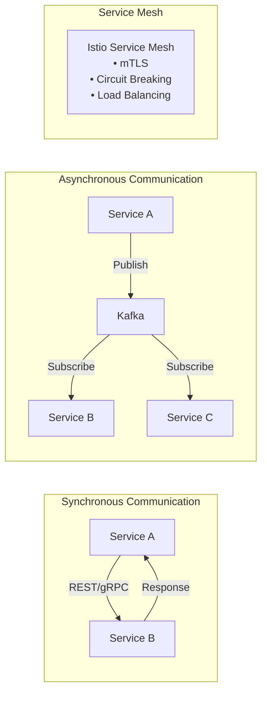
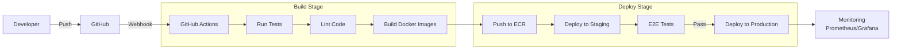
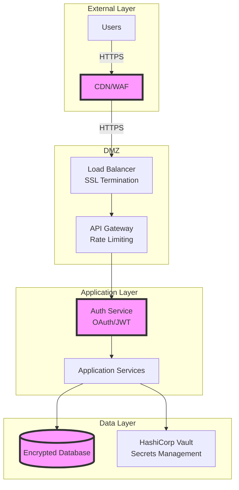
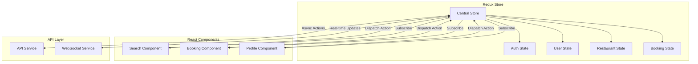
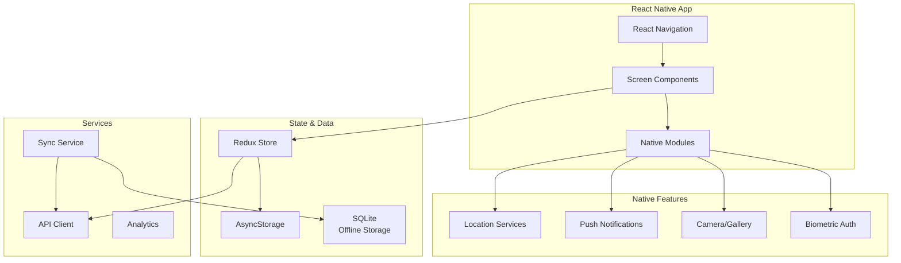
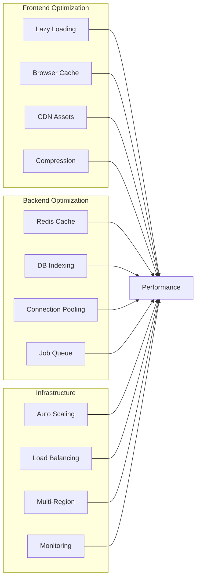

# ServiceSphere Architecture Diagrams

## System Architecture Overview

## Data Flow for Restaurant Booking

## Database Schema Relationships

## Deployment Architecture

## Microservices Communication Pattern

## CI/CD Pipeline

## Security Architecture

## State Management Flow (Frontend)

## Mobile App Architecture

## Performance Optimization Strategy

These diagrams provide a visual representation of the ServiceSphere architecture and can be rendered using any Mermaid-compatible viewer or integrated into documentation tools.
